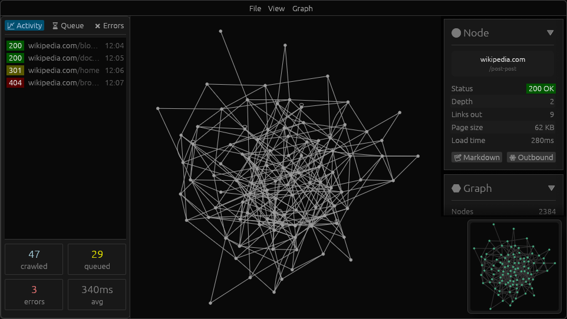

## 🌐 Crawler

A modern asynchronous web crawler written in Rust, with live dynamic graph visualization and interactive GUI.

## Read More
- Read the full blog post on the project: https://raydroplet.dev/log/crawler
